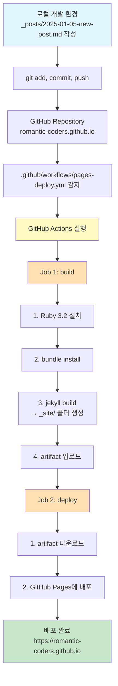
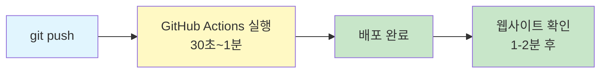

# Jekyll + Chirpy로 팀 기술 블로그 구축하기

RoCo 팀의 기술 블로그를 GitHub Pages로 구축하면서 겪은 시행착오와 해결 과정을 공유합니다. Jekyll과 Chirpy 테마를 사용하여 블로그를 만들고, GitHub Actions로 자동 배포를 설정하는 전 과정을 담았습니다.

## 1. 도입부

### 왜 팀 블로그를 만들게 되었나?

Connectify 프로젝트를 진행하면서 다양한 기술적 도전과 학습을 경험하고 있습니다. 이러한 경험들을 체계적으로 기록하고, 팀원들과 공유하며, 더 나아가 외부 개발자들에게도 도움이 되는 콘텐츠를 만들고자 팀 블로그를 개설하게 되었습니다.

### 기술 스택 선택 이유

**GitHub Pages를 선택한 이유:**
- 무료 호스팅 (비용 부담 없음)
- GitHub과의 완벽한 통합
- HTTPS 자동 지원
- 별도의 서버 관리 불필요

**Jekyll + Chirpy 테마 선택:**
- Markdown으로 간편한 글 작성
- 기술 블로그에 최적화된 UI/UX
- 다크모드, 목차(TOC), 검색 기능 내장
- 활발한 커뮤니티와 문서화

## 2. GitHub 블로그 생태계 이해하기

### GitHub Pages란 무엇인가?

**GitHub Pages는 GitHub에서 제공하는 무료 정적 웹사이트 호스팅 서비스입니다.**

정적 웹사이트란 서버 코드 없이 HTML, CSS, JavaScript만으로 구성된 웹사이트를 의미합니다. GitHub Pages는 저장소의 파일들을 실제 웹사이트로 배포해주며, `username.github.io` 또는 `organization.github.io` 도메인을 제공합니다.

**작동 방식:**

```
저장소의 파일들 → GitHub Pages 처리 → https://romantic-coders.github.io 배포
```

**저장소 구조 예시:**

```console
romantic-coders.github.io/
├── _posts/2025-01-05-title.md  # 마크다운 파일
├── _config.yml                  # 설정 파일
└── index.html                   # 메인 페이지
```

### Jekyll이란?

Jekyll은 Ruby 기반의 **정적 사이트 생성기(Static Site Generator)**입니다.

**주요 역할:**
- Markdown 파일을 HTML로 자동 변환
- Liquid 템플릿 엔진으로 동적 콘텐츠 생성
- `_posts/`, `_layouts/`, `_includes/` 등의 구조화된 디렉토리 사용
- 플러그인 시스템으로 기능 확장

**변환 과정:**

```markdown
# _posts/2025-01-05-hello.md
---
title: "Hello World"
---
안녕하세요!
```

↓ Jekyll이 변환 ↓

```html
<h1>Hello World</h1>
<p>안녕하세요!</p>
```

### Chirpy 테마 소개

Chirpy는 Jekyll용 테마로, 기술 블로그에 최적화되어 있습니다.

**주요 기능:**
- 📱 반응형 디자인 (모바일 최적화)
- 🌙 다크모드/라이트모드 전환
- 🔍 전체 검색 기능
- 📑 자동 목차(TOC) 생성
- 📊 카테고리 & 태그 시스템
- 💬 댓글 시스템 통합 지원

## 3. 배포 자동화 이해하기

### GitHub Actions란?

GitHub Actions는 GitHub에서 제공하는 **CI/CD(Continuous Integration/Continuous Deployment) 도구**입니다.

**CI/CD란?**
- **CI (Continuous Integration)**: 코드 변경사항을 자동으로 빌드하고 테스트
- **CD (Continuous Deployment)**: 빌드된 결과물을 자동으로 배포

**우리 블로그의 CI/CD 프로세스:**

```
코드 Push → GitHub Actions 실행 → Jekyll 빌드 → GitHub Pages 배포 (약 1-2분 소요)
```

### 두 가지 배포 방식의 차이

블로그를 구축하면서 두 가지 배포 방식을 접하게 되었습니다.

#### 1. `pages build and deployment` (GitHub 기본)

GitHub Pages를 활성화하면 자동으로 생성되는 시스템 워크플로우입니다.

**특징:**
- GitHub이 자동으로 관리
- 제한된 플러그인만 지원 (보안상 이유)
- 복잡한 테마나 커스텀 설정 처리 어려움
- Chirpy 테마 같은 경우 의존성 문제로 실패

**왜 실패했나?**

초기 시도(2024-12-24):
```
pages build and deployment 실행
  → jekyll-archives 플러그인 없음 ❌
  → jekyll-include-cache 플러그인 없음 ❌
  → 빌드 실패
```

GitHub의 기본 빌드는 안전한 플러그인만 허용하기 때문에 Chirpy 테마가 요구하는 플러그인들을 사용할 수 없었습니다.

#### 2. `Deploy Jekyll site to Pages` (커스텀 워크플로우)

직접 만든 워크플로우로 전체 빌드 과정을 제어합니다.

**장점:**
- 모든 플러그인 자유롭게 사용 가능
- 빌드 과정 완전 제어
- 디버깅 용이
- 복잡한 의존성 처리 가능

### 현재 배포 프로세스 전체 흐름



**소요 시간:** push 후 약 1-2분 내 배포 완료

## 4. 구축 과정과 마주친 문제들

### 문제 1: Jekyll 버전 호환성

**에러 메시지:**

```
Could not find compatible versions
Because github-pages >= 117, < 178 depends on jekyll-sass-converter = 1.5.0
  and github-pages >= 44, < 147 depends on liquid = 3.0.6,
  github-pages >= 44, < 178 requires jekyll-sass-converter = 1.5.0 or liquid = 3.0.6.
...
version solving has failed.
```

**원인:**

초기 Gemfile에서 `jekyll 4.3`과 `github-pages` gem을 함께 사용하려고 했습니다. 하지만 `github-pages` gem은 특정 버전의 Jekyll만 지원하므로 충돌이 발생했습니다.

**해결:**

`github-pages` gem을 제거하고 필요한 플러그인을 직접 명시했습니다.

```ruby
# 변경 전
gem "jekyll", "~> 4.3"
gem "github-pages", group: :jekyll_plugins

# 변경 후
gem "jekyll", "~> 4.3"
gem "jekyll-theme-chirpy", "~> 7.4"
gem "jekyll-paginate"
gem "jekyll-sitemap"
# ... 필요한 플러그인 직접 추가
```

### 문제 2: 누락된 플러그인들

**에러 1: jekyll-archives**

```
Dependency Error: Yikes! It looks like you don't have jekyll-archives
or one of its dependencies installed.
ERROR: YOUR SITE COULD NOT BE BUILT:
       jekyll-archives
```

**에러 2: jekyll-include-cache**

```
Dependency Error: Yikes! It looks like you don't have jekyll-include-cache
or one of its dependencies installed.
ERROR: YOUR SITE COULD NOT BE BUILT:
       jekyll-include-cache
```

**원인:**

Chirpy 테마가 의존하는 플러그인들이 Gemfile에 명시되지 않았습니다. 테마가 이 플러그인들을 사용하는데, 설치되지 않아 빌드가 실패했습니다.

**해결:**

Gemfile과 _config.yml에 누락된 플러그인을 추가했습니다.

```ruby
# Gemfile에 추가
gem "jekyll-archives"
gem "jekyll-include-cache"
```

```yaml
# _config.yml에 추가
plugins:
  - jekyll-archives
  - jekyll-include-cache
```

### 문제 3: remote_theme vs gem-based theme

**에러 메시지:**

```
Liquid Exception: undefined method `version' for
#<Jekyll::RemoteTheme::MockGemspec:...> in /tmp/jekyll-remote-theme.../default.html
```

**원인:**

`jekyll-remote-theme` 플러그인과 Jekyll 4의 호환성 문제였습니다. `remote_theme` 방식은 GitHub에서 테마를 동적으로 가져오는데, Jekyll 4의 내부 구조 변경으로 인해 테마의 버전 정보를 읽지 못했습니다.

**해결:**

`remote_theme` 방식을 포기하고 gem 기반 테마로 전환했습니다.

```yaml
# _config.yml 변경 전
remote_theme: cotes2020/jekyll-theme-chirpy

# 변경 후
theme: jekyll-theme-chirpy
```

```ruby
# Gemfile 변경
gem "jekyll-theme-chirpy", "~> 7.4"  # gem으로 직접 설치
```

**차이점:**

| 방식 | remote_theme | gem-based theme |
|------|-------------|----------------|
| 설치 방법 | GitHub에서 다운로드 | RubyGems에서 설치 |
| 버전 관리 | branch/tag | semantic versioning |
| 호환성 | Jekyll 3 최적화 | Jekyll 4 지원 |
| 빌드 속도 | 느림 (매번 다운로드) | 빠름 (로컬 캐시) |

### 문제 4: GitHub Actions 워크플로우 설정

**초기 실패 원인:**

GitHub의 기본 빌드 방식으로는 Chirpy 테마의 모든 의존성을 처리할 수 없었습니다.

**해결: 커스텀 워크플로우 생성**

`.github/workflows/pages-deploy.yml` 파일을 생성하여 빌드 과정을 직접 제어했습니다.

```yaml
name: Deploy Jekyll site to Pages

# main 브랜치에 push될 때 자동 실행
on:
  push:
    branches: ["main"]
  workflow_dispatch:  # 수동 실행도 가능

# GitHub Pages 배포를 위한 권한 설정
permissions:
  contents: read      # 저장소 읽기
  pages: write        # Pages 쓰기
  id-token: write     # OIDC 토큰 발급

# 동시 실행 방지 (하나씩 순차 실행)
concurrency:
  group: "pages"
  cancel-in-progress: false

jobs:
  # 빌드 작업
  build:
    runs-on: ubuntu-latest
    steps:
      # 1. 코드 체크아웃 (전체 히스토리 포함)
      - name: Checkout
        uses: actions/checkout@v4
        with:
          fetch-depth: 0  # 전체 git 히스토리 (sitemap 생성용)

      # 2. Ruby 3.2 설치 및 의존성 캐싱
      - name: Setup Ruby
        uses: ruby/setup-ruby@v1
        with:
          ruby-version: '3.2'
          bundler-cache: true  # Gemfile.lock 기반 자동 캐싱

      # 3. GitHub Pages 설정
      - name: Setup Pages
        id: pages
        uses: actions/configure-pages@v4

      # 4. Jekyll 빌드 (프로덕션 모드)
      - name: Build with Jekyll
        run: bundle exec jekyll build --baseurl "${{ steps.pages.outputs.base_path }}"
        env:
          JEKYLL_ENV: production  # 프로덕션 환경 변수

      # 5. 빌드 결과물 업로드
      - name: Upload artifact
        uses: actions/upload-pages-artifact@v3

  # 배포 작업 (빌드 완료 후 실행)
  deploy:
    environment:
      name: github-pages
      url: ${{ steps.deployment.outputs.page_url }}
    runs-on: ubuntu-latest
    needs: build  # build job이 성공해야 실행
    steps:
      # 6. GitHub Pages에 배포
      - name: Deploy to GitHub Pages
        id: deployment
        uses: actions/deploy-pages@v4
```

**주요 포인트:**

1. **두 개의 Job 분리**: `build`와 `deploy`를 분리하여 각 단계를 명확히 구분
2. **의존성 캐싱**: `bundler-cache: true`로 빌드 속도 향상
3. **환경 변수**: `JEKYLL_ENV: production`으로 최적화된 빌드
4. **전체 히스토리**: `fetch-depth: 0`으로 sitemap 생성에 필요한 날짜 정보 확보

## 5. 최종 구성

### Gemfile 전체 코드 (주석 포함)

```ruby
source "https://rubygems.org"

# Jekyll 코어 (4.3 버전 사용)
gem "jekyll", "~> 4.3"

# Chirpy 테마 (gem 방식으로 설치)
gem "jekyll-theme-chirpy", "~> 7.4"

# 필수 Jekyll 플러그인
gem "jekyll-paginate"        # 페이지네이션 (게시물 목록 페이징)
gem "jekyll-sitemap"         # sitemap.xml 자동 생성 (SEO)
gem "jekyll-seo-tag"         # SEO 메타 태그 자동 생성
gem "jekyll-archives"        # 카테고리/태그 아카이브 페이지
gem "jekyll-include-cache"   # include 성능 최적화

# Markdown 파서
gem "kramdown-parser-gfm"    # GitHub Flavored Markdown 지원

# Ruby 3.x 호환성
gem "webrick"                # Ruby 3.x에서 Jekyll 서버 실행용
gem "csv"                    # Ruby 3.x에서 csv 라이브러리
gem "base64"                 # Ruby 3.x에서 base64 라이브러리

# 테스트 도구 (선택사항)
group :test do
  gem "html-proofer", "~> 5.0"  # HTML 유효성 검사
end

# Windows/JRuby 플랫폼 지원
platforms :mingw, :x64_mingw, :mswin, :jruby do
  gem "tzinfo", ">= 1", "< 3"    # 타임존 정보
  gem "tzinfo-data"              # 타임존 데이터
end

# Windows 파일 변경 감지
gem "wdm", "~> 0.1.1", :platforms => [:mingw, :x64_mingw, :mswin]
```

### _config.yml 주요 설정 (주석 포함)

```yaml
# ========================================
# 사이트 기본 설정
# ========================================

# 테마 설정 (gem 기반)
theme: jekyll-theme-chirpy

# 언어 및 타임존
lang: ko-KR
timezone: Asia/Seoul

# 사이트 정보
title: RoCo Tech Blog
tagline: Romantic Coders의 개발 여정
description: 서비스 개발 회고와 기술 경험을 공유하는 RoCo 팀 블로그

# 배포 URL
url: "https://romantic-coders.github.io"

# GitHub 정보
github:
  username: Romantic-Coders

# 소셜 정보
social:
  name: RoCo Team
  email: team@roco.dev
  links:
    - https://github.com/Romantic-Coders

# 기본 작성자 정보
author:
  name: RoCo Team
  bio: 낭만적인 코더들의 모임

# ========================================
# 다중 작성자 설정
# ========================================
# 각 포스트의 front matter에서 author: KeunyoungSong 형식으로 사용

authors:
  KeunyoungSong:
    name: "송근영"
    bio: "Fullstack Developer"
    avatar: "/assets/img/avatars/KeunyoungSong.jpg"
    links:
      - label: "GitHub"
        icon: "fab fa-github"
        url: "https://github.com/KeunyoungSong"

  Dsanj97:
    name: "허동석"
    bio: "Backend Developer"
    avatar: "/assets/img/avatars/Dsanj97.jpg"
    links:
      - label: "GitHub"
        icon: "fab fa-github"
        url: "https://github.com/Dsanj97"

  lilble:
    name: "김예림"
    bio: "Backend Developer"
    avatar: "/assets/img/avatars/lilble.jpg"
    links:
      - label: "GitHub"
        icon: "fab fa-github"
        url: "https://github.com/lilble"

  kimhayeon00:
    name: "김하연"
    bio: "Frontend Developer"
    avatar: "/assets/img/avatars/kimhayeon00.jpg"
    links:
      - label: "GitHub"
        icon: "fab fa-github"
        url: "https://github.com/kimhayeon00"

  j1nzero:
    name: "고진영"
    bio: "Designer"
    avatar: "/assets/img/avatars/j1nzero.jpg"
    links:
      - label: "GitHub"
        icon: "fab fa-github"
        url: "https://github.com/j1nzero"

# ========================================
# 테마 및 UI 설정
# ========================================

theme_mode: dark        # 기본 테마 (dark/light)
avatar: /assets/img/roco-logo.png  # 사이트 로고
toc: true              # 목차(Table of Contents) 자동 생성
paginate: 10           # 페이지당 게시물 수
markdown: kramdown     # Markdown 엔진

# ========================================
# Jekyll 플러그인
# ========================================

plugins:
  - jekyll-paginate       # 페이지네이션
  - jekyll-sitemap        # sitemap.xml 생성
  - jekyll-seo-tag        # SEO 메타 태그
  - jekyll-archives       # 카테고리/태그 아카이브
  - jekyll-include-cache  # include 캐싱

# ========================================
# Markdown 설정
# ========================================

kramdown:
  syntax_highlighter: rouge  # 코드 하이라이팅

# ========================================
# Collections (탭 메뉴)
# ========================================

collections:
  tabs:
    output: true
    sort_by: order

# ========================================
# 기본값 설정
# ========================================

defaults:
  # 모든 포스트의 기본값
  - scope:
      path: ""
      type: posts
    values:
      layout: post
      comments: true        # 댓글 활성화
      toc: true            # 목차 활성화
      permalink: /posts/:title/

  # 탭 페이지의 기본값
  - scope:
      path: ""
      type: tabs
    values:
      layout: page
      permalink: /:title/
```

### 디렉토리 구조

```console
romantic-coders.github.io/
├── .github/
│   └── workflows/
│       └── pages-deploy.yml     # GitHub Actions 워크플로우
├── _posts/                      # 블로그 게시물
│   ├── 2024-12-24-welcome-to-roco-blog.md
│   └── 2025-01-05-building-team-blog.md
├── _tabs/                       # 상단 탭 메뉴 페이지
│   └── about.md                 # About 페이지
├── assets/
│   └── img/
│       ├── avatars/             # 작성자 프로필 이미지
│       │   ├── KeunyoungSong.jpg
│       │   ├── Dsanj97.jpg
│       │   └── ...
│       └── roco-logo.png        # 사이트 로고
├── _config.yml                  # Jekyll 설정 파일
├── Gemfile                      # Ruby 의존성 관리
├── .gitignore                   # Git 무시 파일 목록
├── index.html                   # 메인 페이지
└── README.md                    # 프로젝트 설명
```

### .gitignore 설정

```gitignore
# Bundler 캐시 (로컬 gem 설치 디렉토리)
.bundle
vendor
Gemfile.lock                     # 버전 잠금 파일 (CI에서 재생성)

# Jekyll 캐시 (빌드 시 자동 생성)
.jekyll-cache
.jekyll-metadata                 # 증분 빌드용 메타데이터
.sass-cache                      # Sass 컴파일 캐시
_site                            # 빌드 결과물 디렉토리

# RubyGems
*.gem

# NPM 의존성 (프론트엔드 도구 사용 시)
node_modules
package-lock.json
yarn.lock

# IDE 설정
.idea                            # IntelliJ IDEA
.vscode                          # Visual Studio Code
.claude                          # Claude Code CLI

# 기타
assets/js/dist                   # 빌드된 JavaScript
*.swp                            # Vim swap 파일
*.swo
*~
.DS_Store                        # macOS 파일

# 로그 파일
*.log

# 임시 파일
*.tmp
*.bak
*.backup
```

## 6. 블로그 게시물 작성 가이드

### 새 게시물 작성하기

#### 1. 파일 생성

`_posts/` 디렉토리에 다음 형식으로 파일을 생성합니다:

```
_posts/YYYY-MM-DD-title-in-english.md
```

**예시:**
```
_posts/2025-01-05-how-to-use-docker.md
```

#### 2. Front Matter 작성

파일 상단에 YAML 형식의 메타데이터를 작성합니다:

```yaml
---
title: "Docker 기초부터 실전까지"           # 게시물 제목
author: KeunyoungSong                     # 작성자 ID (_config.yml의 authors에 정의)
date: 2025-01-05 14:30:00 +0900          # 작성 날짜 및 시간
categories: [개발, DevOps]                # 카테고리 (최대 2개 권장)
tags: [docker, container, deployment]    # 태그 (여러 개 가능)
---
```

**필수 필드:**
- `title`: 게시물 제목
- `author`: 작성자 (authors에 정의된 ID)
- `date`: 날짜 및 시간

**선택 필드:**
- `categories`: 카테고리 (계층 구조 가능)
- `tags`: 태그
- `pin`: true로 설정 시 상단 고정
- `image`: 대표 이미지 URL

#### 3. 본문 작성

Front Matter 아래에 Markdown으로 본문을 작성합니다:

```markdown
---
title: "Docker 기초부터 실전까지"
author: KeunyoungSong
date: 2025-01-05 14:30:00 +0900
categories: [개발, DevOps]
tags: [docker, container]
---

# Docker란?

Docker는 컨테이너 기반의 가상화 플랫폼입니다.

## 주요 개념

### 이미지
이미지는 컨테이너의 템플릿입니다.

### 컨테이너
실행 중인 이미지 인스턴스입니다.

## 코드 예시

```bash
# Docker 이미지 빌드
docker build -t myapp:latest .

# 컨테이너 실행
docker run -p 8080:80 myapp:latest
```

> 팁: 로컬에서 먼저 테스트해보세요!

더 자세한 내용은 [공식 문서](https://docs.docker.com)를 참고하세요.
```

**Markdown 팁:**

```markdown
# H1 제목
## H2 제목
### H3 제목

**굵은 글씨**
*기울임*

- 순서 없는 목록
- 항목 2

1. 순서 있는 목록
2. 항목 2

[링크 텍스트](https://example.com)


> 인용문

`인라인 코드`

```language
코드 블록
```

| 표 | 헤더 |
|---|---|
| 셀1 | 셀2 |
```

### 로컬 테스트

배포하기 전에 로컬에서 미리 확인할 수 있습니다.

#### 1. 의존성 설치 (최초 1회)

```bash
bundle install
```

#### 2. 로컬 서버 실행

```bash
bundle exec jekyll serve
```

#### 3. 브라우저에서 확인

```
http://localhost:4000
```

**실시간 수정 확인:**
- 파일을 수정하면 자동으로 재빌드
- 브라우저를 새로고침하면 변경사항 반영
- `_config.yml` 변경 시에는 서버 재시작 필요

**서버 종료:**
```bash
Ctrl + C
```

### 배포하기

로컬 테스트가 완료되면 GitHub에 push합니다.

```bash
# 변경사항 확인
git status

# 파일 추가
git add _posts/2025-01-05-new-post.md

# 커밋
git commit -m "포스트 추가: Docker 기초부터 실전까지"

# 원격 저장소에 푸시
git push origin main
```

**배포 과정:**



**확인 방법:**
1. GitHub 저장소 > Actions 탭 > 초록색 체크 확인
2. https://romantic-coders.github.io 접속하여 새 게시물 확인

## 7. 트러블슈팅 팁

### Actions 실패 시 로그 확인 방법

#### 1. GitHub 웹에서 확인

```
저장소 > Actions 탭 > 실패한 워크플로우 클릭 > build 또는 deploy 클릭
```

#### 2. 명령줄에서 확인 (GitHub CLI 사용)

```bash
# 최근 워크플로우 실행 목록
gh run list --limit 5

# 특정 워크플로우 상세 보기
gh run view [RUN_ID]

# 실패한 로그만 보기
gh run view [RUN_ID] --log-failed
```

### 자주 발생하는 에러와 해결법

#### 에러 1: "Bundler could not find compatible versions"

**원인:** Gemfile의 gem 버전 충돌

**해결:**
```bash
# 로컬에서 Gemfile.lock 삭제 후 재생성
rm Gemfile.lock
bundle install
git add Gemfile.lock
git commit -m "Update Gemfile.lock"
git push
```

#### 에러 2: "Liquid Exception: undefined method"

**원인:** 플러그인 누락 또는 Liquid 템플릿 문법 오류

**해결:**
1. 에러 메시지에서 누락된 플러그인 확인
2. Gemfile과 _config.yml에 플러그인 추가
3. 로컬에서 `bundle install` 실행 후 테스트

#### 에러 3: "Could not read file"

**원인:** 파일 경로 오류 또는 인코딩 문제

**해결:**
1. 파일 경로가 올바른지 확인
2. 파일이 UTF-8 인코딩인지 확인
3. 파일명에 특수문자가 있는지 확인

#### 에러 4: "GitHub Pages build failed"

**원인:** _config.yml 문법 오류

**해결:**
1. YAML 문법 검증: https://www.yamllint.com/
2. 들여쓰기 확인 (스페이스 2칸)
3. 콜론(:) 뒤에 공백 확인

### 의존성 충돌 해결 전략

#### 1. 버전 범위 넓히기

```ruby
# 엄격한 버전 (충돌 가능성 높음)
gem "jekyll", "4.3.0"

# 유연한 버전 (권장)
gem "jekyll", "~> 4.3"  # 4.3.x 허용 (4.4는 불가)
```

#### 2. 호환성 확인

공식 문서에서 지원 버전 확인:
- Jekyll: https://jekyllrb.com/
- Chirpy: https://github.com/cotes2020/jekyll-theme-chirpy

#### 3. 최소 버전 명시

```ruby
# 특정 버전 이상
gem "jekyll", ">= 4.3"
```

### 디버깅 도구

#### Jekyll 빌드 디버그 모드

```bash
bundle exec jekyll build --verbose --trace
```

#### 의존성 트리 확인

```bash
bundle list
```

#### 특정 gem 버전 확인

```bash
bundle info jekyll
```

## 8. 배운 점과 느낀 점

### Jekyll 생태계에 대한 이해

Jekyll을 처음 접했을 때는 단순히 "Markdown을 HTML로 바꿔주는 도구" 정도로만 생각했습니다. 하지만 실제로 블로그를 구축하면서 Jekyll이 단순한 변환기가 아니라 **완전한 정적 사이트 생성 플랫폼**임을 깨달았습니다.

**핵심 개념:**
- **Collections**: 포스트, 페이지, 커스텀 컬렉션으로 콘텐츠 구조화
- **Liquid 템플릿**: 동적 콘텐츠 생성의 강력함
- **플러그인 시스템**: 기능 확장의 무한한 가능성
- **Front Matter**: 메타데이터 중심의 콘텐츠 관리

특히 `_config.yml`의 defaults 설정을 통해 모든 포스트에 공통 설정을 적용할 수 있다는 점이 인상적이었습니다. 이는 대규모 블로그 운영 시 일관성을 유지하는 데 큰 도움이 됩니다.

### GitHub Actions의 강력함

GitHub Actions는 단순히 "자동 배포 도구"를 넘어서는 강력한 CI/CD 플랫폼입니다.

**인상 깊었던 점:**
1. **Matrix 빌드**: 여러 환경에서 동시 테스트 가능
2. **Artifact 시스템**: 빌드 결과물을 다음 Job에서 재사용
3. **Caching**: 의존성 캐싱으로 빌드 속도 최적화
4. **Secrets 관리**: 민감한 정보를 안전하게 관리

특히 `bundler-cache: true` 한 줄로 빌드 시간을 절반으로 줄일 수 있었던 점이 놀라웠습니다.

### 문서화와 공유의 중요성

이번 블로그 구축 과정에서 가장 큰 도움이 된 것은 **다른 개발자들의 트러블슈팅 기록**이었습니다.

- Stack Overflow의 질문과 답변
- GitHub Issues의 해결 과정
- 개인 블로그의 회고 글

이러한 문서들이 없었다면 각 에러를 해결하는 데 훨씬 더 많은 시간이 걸렸을 것입니다. 이번 경험을 통해 **내가 겪은 문제를 공유하는 것이 미래의 누군가에게 큰 도움이 될 수 있다**는 것을 깨달았습니다.

그래서 이 글을 최대한 상세하게 작성했습니다. 같은 문제를 겪는 분들께 도움이 되길 바랍니다.

### 시행착오를 통한 학습

이번 프로젝트에서 가장 값진 교훈은 **실패를 두려워하지 않는 것**입니다.

**실패의 가치:**
- Jekyll 3.10 → 4.3 전환 실패 → Jekyll 버전 호환성 이해
- remote_theme 실패 → gem 기반 테마의 장점 발견
- 플러그인 누락 → 의존성 관리의 중요성 인식

각각의 실패는 단순한 에러가 아니라 **시스템을 더 깊이 이해하는 기회**였습니다. 에러 메시지를 읽고, 로그를 분석하고, 공식 문서를 찾아보는 과정에서 Jekyll과 GitHub Actions의 내부 작동 방식을 배울 수 있었습니다.

**실패에서 배운 접근법:**
1. 에러 메시지를 정확히 읽기
2. 공식 문서 먼저 확인하기
3. 커뮤니티 검색하기 (GitHub Issues, Stack Overflow)
4. 최소한의 변경으로 테스트하기
5. 성공한 설정 백업하기

### 마치며

Jekyll + Chirpy + GitHub Pages로 팀 블로그를 구축하는 과정은 쉽지 않았지만, 그만큼 많은 것을 배울 수 있는 여정이었습니다. 이제 우리 팀은 **안정적인 기술 블로그 플랫폼**을 갖추게 되었고, 앞으로 이곳에서 다양한 개발 경험과 인사이트를 공유할 예정입니다.

이 글이 Jekyll 블로그를 만들려는 분들, 특히 Chirpy 테마를 사용하려는 분들께 도움이 되길 바랍니다. 궁금한 점이나 추가로 도움이 필요하신 부분이 있다면 댓글로 남겨주세요!

---

**참고 자료:**
- [Jekyll 공식 문서](https://jekyllrb.com/docs/)
- [Chirpy 테마 공식 문서](https://github.com/cotes2020/jekyll-theme-chirpy/wiki)
- [GitHub Pages 문서](https://docs.github.com/en/pages)
- [GitHub Actions 문서](https://docs.github.com/en/actions)
