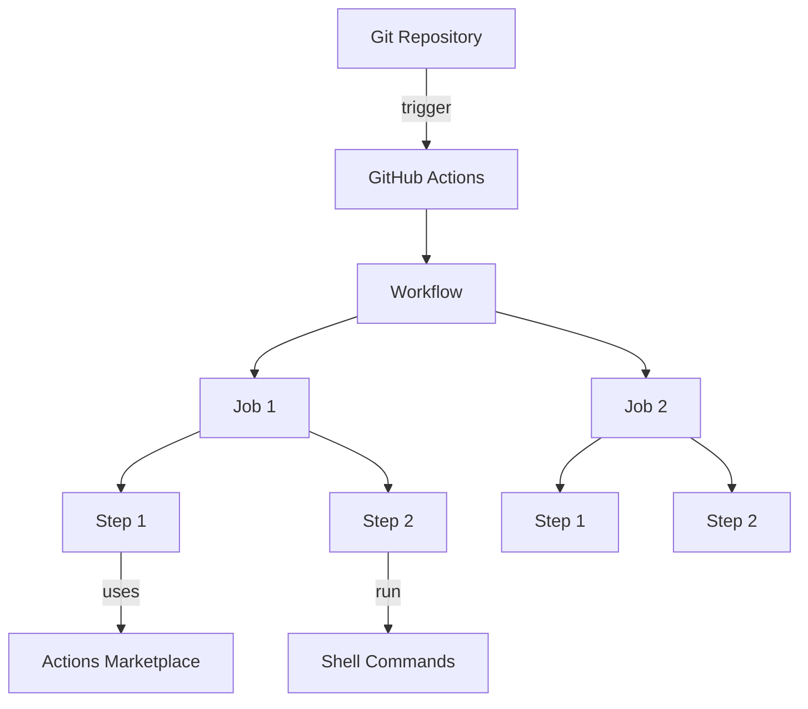
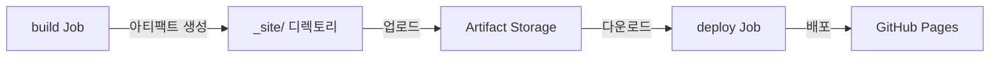
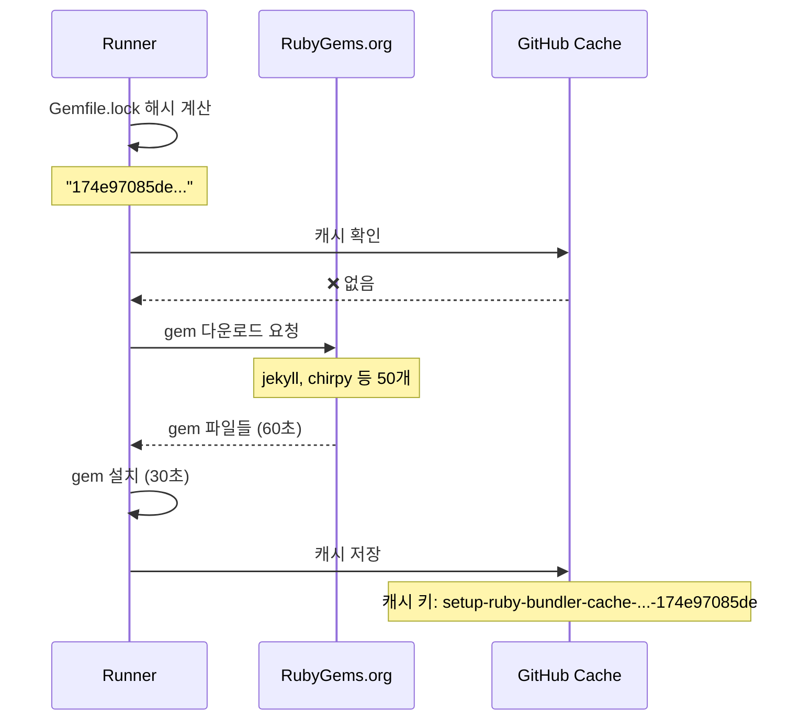
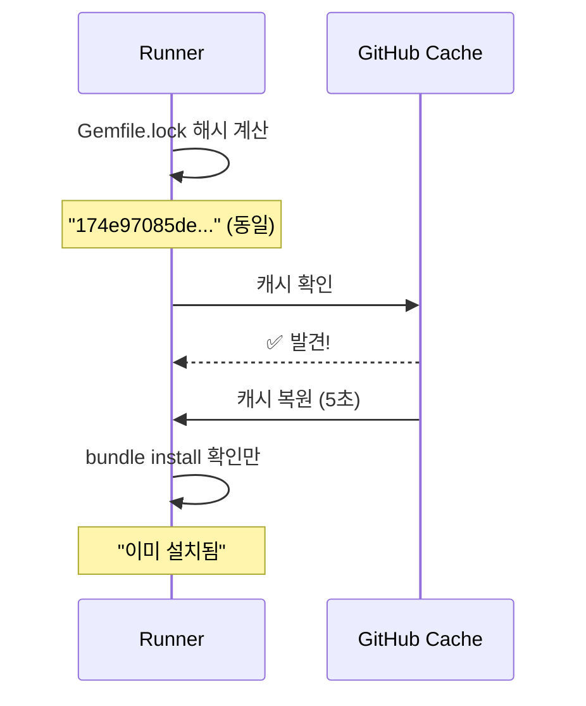
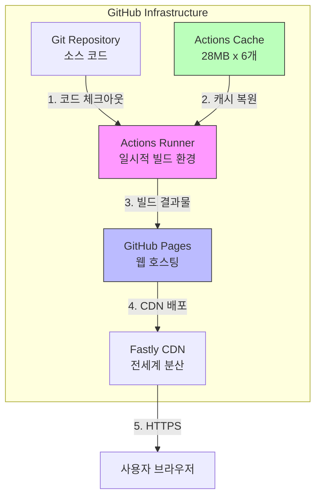
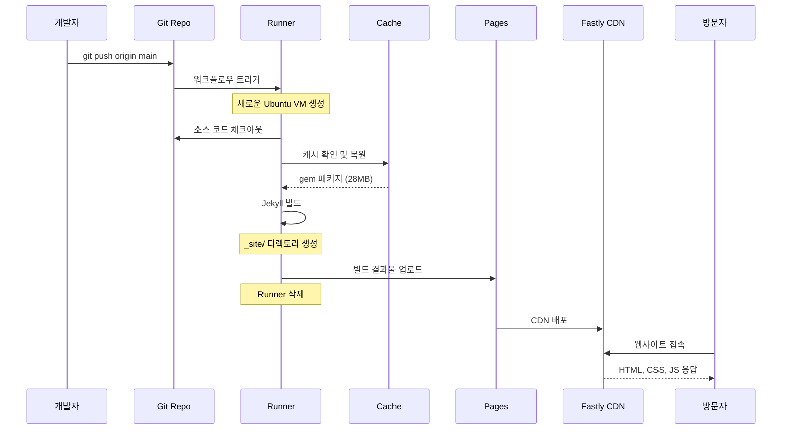

# GitHub Actions 생태계 완전 정복

팀 블로그를 운영하면서 GitHub Actions의 배포 워크플로우를 깊이 있게 분석할 기회가 있었습니다. 단순히 "자동 배포가 된다"는 것을 넘어서, GitHub Actions 생태계 전체를 이해하고, 캐싱이 어떻게 동작하는지, 실제로 어디에 배포되는지를 파헤쳐봤습니다.

## 목차
1. GitHub Actions 생태계 개요
2. 핵심 개념 이해하기
3. 우리 블로그의 배포 워크플로우 분석
4. 캐싱 메커니즘 심층 분석
5. 배포 아키텍처 이해하기
6. 최적화 전략

---

## 1. GitHub Actions 생태계 개요

GitHub Actions는 GitHub에서 제공하는 CI/CD 플랫폼입니다. 코드 저장소에서 발생하는 이벤트를 트리거로 자동화된 워크플로우를 실행할 수 있습니다.

### 생태계 구성 요소



---

## 2. 핵심 개념 이해하기

### 2.1 Workflow (워크플로우)

`.github/workflows/` 디렉토리에 있는 YAML 파일로 자동화 프로세스를 정의합니다.

```yaml
# 예시: .github/workflows/deploy.yml
name: Deploy to Production

on:
  push:
    branches: ["main"]
```

### 2.2 Event (이벤트)

워크플로우를 실행시키는 트리거입니다.

**주요 이벤트:**
- `push`: 코드 푸시 시
- `pull_request`: PR 생성/업데이트 시
- `schedule`: 정기적인 실행 (cron)
- `workflow_dispatch`: 수동 실행
- `release`: 릴리스 생성 시

### 2.3 Job (작업)

워크플로우 내에서 실행되는 독립적인 작업 단위입니다.

**중요한 특징:**
- 기본적으로 **병렬 실행**됨
- `needs` 키워드로 순차 실행 가능
- 각 Job은 독립된 가상 머신(Runner)에서 실행

```yaml
jobs:
  test:
    runs-on: ubuntu-latest
    # 테스트 작업

  lint:
    runs-on: ubuntu-latest
    # 린팅 작업 (test와 병렬 실행)

  deploy:
    runs-on: ubuntu-latest
    needs: [test, lint]  # test, lint 완료 후 실행
```

### 2.4 Step (단계)

Job 내에서 순차적으로 실행되는 개별 명령입니다.

```yaml
steps:
  - uses: actions/checkout@v4      # Action 실행
  - run: npm install               # Shell 명령 실행
  - run: npm test                  # Shell 명령 실행
```

### 2.5 Runner (러너)

워크플로우를 실행하는 서버입니다.

**GitHub 호스팅 러너:**
- `ubuntu-latest`
- `windows-latest`
- `macos-latest`

**Self-hosted 러너:**
- 직접 관리하는 서버 사용 가능

### 2.6 Action (액션)

재사용 가능한 작업 단위로, GitHub Marketplace에서 공유됩니다.

**인기 있는 Actions:**
- `actions/checkout@v4`: 코드 체크아웃
- `actions/setup-node@v4`: Node.js 설정
- `ruby/setup-ruby@v1`: Ruby 설정
- `actions/cache@v3`: 의존성 캐싱

---

## 3. 우리 블로그의 배포 워크플로우 분석

현재 팀 블로그는 다음과 같은 워크플로우로 자동 배포됩니다.

### 3.1 전체 워크플로우 구조

```yaml
name: Deploy Jekyll site to Pages

on:
  push:
    branches: ["main"]    # main 브랜치에 푸시 시 자동 실행
  workflow_dispatch:       # 수동 실행 가능

permissions:
  contents: read           # 코드 읽기 권한
  pages: write            # GitHub Pages 배포 권한
  id-token: write         # OIDC 인증 토큰 권한

concurrency:
  group: "pages"
  cancel-in-progress: false  # 순차적 배포 보장

jobs:
  build:
    # 빌드 작업

  deploy:
    needs: build          # build 완료 후 실행
    # 배포 작업
```

### 3.2 왜 Job이 병렬이 아니고 순차 실행인가?

많은 분들이 궁금해하시는 부분입니다. `deploy` Job에 `needs: build`가 있어서 순차 실행됩니다.

**병렬 실행이 불가능한 이유:**



deploy Job은 build Job의 **결과물**이 필요하기 때문입니다.

**만약 병렬로 실행한다면:**
```yaml
jobs:
  build:
    # 빌드 중...

  deploy:
    # needs를 제거하면 병렬 실행
    # ❌ 에러 발생: Artifact not found
```

build Job이 완료되지 않은 상태에서 deploy Job이 실행되면 배포할 파일이 없어서 실패합니다.

**실제 타이밍:**
```
0:00 - build Job 시작 (Runner 1 할당)
0:30 - build Job 진행 중 (Ruby 설치, Jekyll 빌드)
1:00 - build Job 완료 (아티팩트 업로드)
1:00 - deploy Job 시작 (Runner 2 할당) ← build 완료 후 시작
1:10 - deploy Job 완료
```

### 3.3 Build Job 상세 분석


```yaml
build:
  runs-on: ubuntu-latest
  steps:
    # 1. 코드 체크아웃
    - name: Checkout
      uses: actions/checkout@v4
      with:
        fetch-depth: 0  # 전체 Git 히스토리 (Jekyll 수정일 표시용)

    # 2. Ruby 환경 설정
    - name: Setup Ruby
      uses: ruby/setup-ruby@v1
      with:
        ruby-version: '3.2'
        bundler-cache: true  # 🔥 캐싱 활성화 (핵심!)

    # 3. GitHub Pages 설정
    - name: Setup Pages
      id: pages
      uses: actions/configure-pages@v4

    # 4. Jekyll 빌드
    - name: Build with Jekyll
      run: bundle exec jekyll build --baseurl "${{ steps.pages.outputs.base_path }}"
      env:
        JEKYLL_ENV: production

    # 5. 빌드 결과물 업로드
    - name: Upload artifact
      uses: actions/upload-pages-artifact@v3
```


**각 단계 설명:**

1. **Checkout**: Git 저장소의 코드를 Runner에 다운로드
   - `fetch-depth: 0`: 전체 커밋 히스토리 포함 (포스트의 마지막 수정일 표시에 필요)

2. **Setup Ruby**: Ruby 환경 설정 및 gem 캐싱
   - `bundler-cache: true`: Gemfile.lock 기반 자동 캐싱

3. **Setup Pages**: GitHub Pages 설정 자동 구성
   - baseurl, domain 등 자동 감지

4. **Build with Jekyll**: Jekyll 정적 사이트 생성
   - `_site/` 디렉토리에 HTML, CSS, JS 파일 생성
   - `JEKYLL_ENV: production`: 프로덕션 모드 (최적화 활성화)

5. **Upload artifact**: 빌드 결과물을 아티팩트로 저장
   - 다음 Job에서 사용

### 3.4 Deploy Job 상세 분석


```yaml
deploy:
  environment:
    name: github-pages
    url: ${{ steps.deployment.outputs.page_url }}
  runs-on: ubuntu-latest
  needs: build  # build Job 성공 후 실행
  steps:
    - name: Deploy to GitHub Pages
      id: deployment
      uses: actions/deploy-pages@v4
```


**deploy Job의 역할:**
- build Job에서 생성한 아티팩트 다운로드
- GitHub Pages에 배포
- 배포 URL 출력

---

## 4. 캐싱 메커니즘 심층 분석

### 4.1 Gem 캐싱이란?

Ruby 프로젝트에서 사용하는 라이브러리(gem)들을 매번 다운로드하지 않고 재사용하는 메커니즘입니다.

**우리 블로그의 Gemfile:**
```ruby
gem "jekyll", "~> 4.3"
gem "jekyll-theme-chirpy", "~> 7.4"
gem "jekyll-paginate"
gem "jekyll-sitemap"
gem "jekyll-seo-tag"
gem "jekyll-archives"
gem "html-proofer", "~> 5.0"
# ... 총 약 50개의 gem
```

이런 gem들을 매번 다운로드하면 시간이 오래 걸립니다.

### 4.2 캐싱 동작 과정

#### 첫 번째 빌드 (캐시 없음)



**소요 시간: 약 90초**

#### 두 번째 빌드 (캐시 있음)



**소요 시간: 약 5초** (94% 단축!)

### 4.3 캐시 키 생성 방식

`ruby/setup-ruby@v1` 액션이 자동으로 생성합니다:

```
캐시 키 = "setup-ruby-bundler-cache-v6-
           ubuntu-24.04-
           x64-
           ruby-3.2.9-
           wd-/home/runner/work/romantic-coders.github.io/romantic-coders.github.io-
           with--without--only--
           Gemfile.lock-
           174e97085deacdeb81ecd6e1d502d64bae255374cb3e2fc06013d2840654ed02"
```

**구성 요소:**
- OS 정보: `ubuntu-24.04`, `x64`
- Ruby 버전: `ruby-3.2.9`
- 작업 디렉토리
- **Gemfile.lock 해시**: `174e97085de...` (핵심!)

### 4.4 캐시 무효화 시점

캐시가 무효화되고 다시 다운로드하는 경우:

**1. Gemfile.lock 변경**
```bash
# Gem 추가 또는 업데이트
bundle add jekyll-feed
bundle update jekyll

# → Gemfile.lock 변경
# → 해시 변경: 174e97085de → abc123def456
# → 새로운 캐시 키 생성
# → 다시 다운로드
```

**2. Ruby 버전 변경**
```yaml
ruby-version: '3.3'  # 3.2 → 3.3 변경
# → 캐시 키 변경
# → 다시 다운로드
```

**3. 캐시 만료**
- 7일간 미사용 시 자동 삭제
- 저장소당 캐시 용량 제한: 10GB

### 4.5 실제 캐시 확인하기

우리 블로그의 실제 캐시 정보:

```bash
# GitHub CLI로 캐시 확인
gh api repos/romantic-coders/romantic-coders.github.io/actions/caches
```

**결과:**
```
캐시 1: 28MB | 생성: 2026-01-11 | 마지막 사용: 2026-01-11
캐시 2: 28MB | 생성: 2026-01-05 | 마지막 사용: 2026-01-11
캐시 3: 27MB | 생성: 2026-01-05 | 마지막 사용: 2026-01-05
...
총 6개 캐시 보유
```

### 4.6 캐싱 효과 비교

| 단계 | 캐싱 없음 | 캐싱 있음 | 개선율 |
|------|----------|----------|--------|
| Ruby 설치 | 10초 | 10초 | - |
| Gem 다운로드 | 60초 | **생략** | 100% |
| Gem 설치 | 30초 | **5초** | 83% |
| Jekyll 빌드 | 20초 | 20초 | - |
| **총 빌드 시간** | **120초** | **35초** | **70%** |

---

## 5. 배포 아키텍처 이해하기

### 5.1 전체 아키텍처



### 5.2 각 구성 요소 설명

#### Git Repository (소스 코드 저장소)
- **위치**: GitHub 저장소 데이터베이스
- **내용**: Jekyll 소스 파일, Markdown 포스트
- **크기**: 약 수 MB
- **접근**: `git clone`, GitHub UI

#### Actions Cache (캐시 저장소)
- **위치**: GitHub Actions 전용 스토리지
- **내용**: Ruby gem 패키지들
- **크기**: 캐시당 약 28MB, 최대 10GB
- **수명**: 7일간 미사용 시 자동 삭제
- **접근**: GitHub Actions Runner만 접근 가능

#### Actions Runner (빌드 서버)
- **위치**: GitHub의 가상 머신
- **역할**: Jekyll 빌드 실행
- **수명**: 일시적 (빌드 중만 존재)
- **특징**: 빌드 완료 후 자동 삭제

#### GitHub Pages (웹 호스팅)
- **위치**: GitHub Pages 서버 + Fastly CDN
- **내용**: 빌드된 HTML, CSS, JS 파일
- **크기**: 최대 1GB 제한
- **수명**: 영구적 (24/7 서비스)
- **접근**: `https://romantic-coders.github.io`

### 5.3 배포 프로세스 상세



**단계별 설명:**

1. **개발자가 main 브랜치에 푸시**
   - 새 블로그 포스트 작성 또는 코드 수정

2. **워크플로우 트리거**
   - GitHub Actions가 자동으로 시작

3. **Runner 생성 및 환경 준비**
   - Ubuntu 24.04 가상 머신 할당
   - 깨끗한 환경 (아무것도 설치 안됨)

4. **소스 코드 체크아웃**
   - Git 저장소에서 코드 다운로드

5. **캐시 복원**
   - Gemfile.lock 해시 확인
   - 일치하는 캐시 발견 시 복원 (5초)
   - 없으면 gem 다운로드 (60초)

6. **Jekyll 빌드**
   - `bundle exec jekyll build` 실행
   - `_site/` 디렉토리에 정적 파일 생성

7. **결과물 업로드**
   - GitHub Pages에 빌드 결과 전송

8. **Runner 삭제**
   - 일시적 VM 제거

9. **CDN 배포**
   - Fastly CDN에 전세계 분산 배포

10. **사용자 접근**
    - `https://romantic-coders.github.io` 접속

### 5.4 데이터 흐름도

```
로컬 개발 환경
    │
    │ git push
    ▼
┌─────────────────────────────────────────┐
│          GitHub Infrastructure           │
│                                          │
│  Git Repository (소스)                   │
│      ↓                                   │
│  Actions Runner (빌드) ← Cache (gem)    │
│      ↓                                   │
│  GitHub Pages (호스팅)                   │
│      ↓                                   │
│  Fastly CDN (전세계 배포)                │
└──────────────┬──────────────────────────┘
               │
               │ HTTPS
               ▼
        사용자 브라우저
```

---

## 6. 최적화 전략

### 6.1 캐싱 최적화

**1. Gemfile.lock 관리**
```bash
# 불필요한 gem 업데이트 지양
# 필요한 경우에만 업데이트
bundle update jekyll

# 커밋 전 Gemfile.lock 확인
git diff Gemfile.lock
```

**2. 다단계 캐싱 활용**

```yaml
- uses: actions/cache@v3
  with:
    path: |
      vendor/bundle
      node_modules
    key: ${{ runner.os }}-gems-${{ hashFiles('**/Gemfile.lock') }}
```


### 6.2 Job 병렬화

의존성이 없는 작업은 병렬로 실행:

```yaml
jobs:
  test:
    runs-on: ubuntu-latest
    steps:
      - run: bundle exec rake test

  lint:
    runs-on: ubuntu-latest
    # test와 병렬 실행
    steps:
      - run: bundle exec rubocop

  build:
    needs: [test, lint]  # 둘 다 성공 후 실행
    runs-on: ubuntu-latest
```

### 6.3 아티팩트 최적화

불필요한 파일 제외:

```yaml
- uses: actions/upload-pages-artifact@v3
  with:
    path: _site
    # .git, node_modules 등은 자동 제외됨
```

### 6.4 빌드 시간 모니터링

```bash
# 최근 워크플로우 실행 시간 확인
gh run list --limit 10 --json conclusion,createdAt,updatedAt

# 특정 실행의 상세 로그
gh run view <run-id> --log
```

### 6.5 비용 최적화

**무료 플랜 제한:**
- Public 저장소: 무제한
- Private 저장소: 월 2,000분

**최적화 팁:**
- 불필요한 워크플로우 트리거 제거
- 캐싱으로 빌드 시간 단축
- 병렬 Job으로 전체 시간 단축

---

## 7. 실제 사용 시나리오

### 시나리오 1: 새 블로그 글 작성

```bash
# 1. 로컬에서 포스트 작성
vim _posts/2026-01-11-new-post.md

# 2. 로컬에서 미리보기
bundle exec jekyll serve

# 3. Git 커밋 및 푸시
git add _posts/2026-01-11-new-post.md
git commit -m "Add new blog post"
git push origin main

# 4. GitHub Actions 자동 실행
# - 빌드: 약 35초 (캐시 있음)
# - 배포: 약 10초
# - 총: 45초 후 사이트 업데이트
```

### 시나리오 2: Gem 업데이트

```bash
# 1. Jekyll 업데이트
bundle update jekyll

# 2. Gemfile.lock 변경 확인
git diff Gemfile.lock

# 3. 푸시
git push origin main

# 4. GitHub Actions 실행
# - 첫 빌드: 약 120초 (캐시 무효화)
# - 이후 빌드: 약 35초 (새 캐시 사용)
```

### 시나리오 3: 배포 실패 디버깅

```bash
# 1. 최근 워크플로우 확인
gh run list --limit 5

# 2. 실패한 실행의 로그 확인
gh run view <run-id> --log

# 3. 문제 수정 후 재푸시 또는
gh run rerun <run-id>  # 수동 재실행
```

---

## 8. 모니터링 및 문서화

### 8.1 배포 상태 확인

**GitHub UI:**
- Repository → Actions 탭
- 각 워크플로우 실행 기록 확인
- 로그, 타이밍, 아티팩트 확인

**GitHub CLI:**
```bash
# 워크플로우 실행 목록
gh run list

# 특정 실행 상세 정보
gh run view <run-id>

# 캐시 확인
gh api repos/{owner}/{repo}/actions/caches
```

### 8.2 배지 추가

README에 빌드 상태 배지 추가:

```markdown

```

### 8.3 알림 설정

워크플로우 실패 시 알림:
- GitHub Settings → Notifications
- Email 또는 Slack 연동

---

## 9. 트러블슈팅

### 문제 1: 캐시가 작동하지 않음

**원인:**
- Gemfile.lock 변경
- Ruby 버전 변경
- 캐시 만료 (7일)

**해결:**
```yaml
# 캐시 키 확인
- name: Debug cache
  run: |
    echo "Cache key: setup-ruby-bundler-cache-..."
    ls -la vendor/bundle || echo "No cache"
```

### 문제 2: 빌드는 성공했지만 배포 안됨

**원인:**
- GitHub Pages 설정 오류
- 권한 부족

**해결:**
```yaml
# permissions 확인
permissions:
  contents: read
  pages: write
  id-token: write
```

### 문제 3: 빌드 시간이 너무 오래 걸림

**원인:**
- 캐싱 미활성화
- 불필요한 gem 설치

**해결:**
```yaml
# bundler-cache 활성화 확인
- uses: ruby/setup-ruby@v1
  with:
    bundler-cache: true  # 반드시 true
```

---

## 10. 결론

GitHub Actions 생태계를 깊이 이해하면서 다음을 배웠습니다:

**핵심 인사이트:**

1. **Job 분리의 중요성**
   - 논리적 의존성 고려
   - 병렬/순차 실행 전략

2. **캐싱의 위력**
   - 빌드 시간 70% 단축
   - Gemfile.lock 기반 자동 캐싱

3. **배포 아키텍처 이해**
   - Runner는 일시적, Pages는 영구적
   - Cache는 독립적인 저장소

4. **최적화 기회**
   - 불필요한 빌드 트리거 제거
   - 의존성 최소화
   - 모니터링 및 디버깅

**다음 단계:**
- 멀티 환경 배포 (staging, production)
- E2E 테스트 자동화
- 성능 모니터링 통합
- Lighthouse CI 추가

팀원 여러분도 이 글을 통해 GitHub Actions의 동작 원리를 이해하고, 더 나은 CI/CD 파이프라인을 구축하는 데 도움이 되길 바랍니다!

---

## 참고 자료

- [GitHub Actions 공식 문서](https://docs.github.com/en/actions)
- [ruby/setup-ruby 액션](https://github.com/ruby/setup-ruby)
- [GitHub Actions 캐싱 가이드](https://docs.github.com/en/actions/using-workflows/caching-dependencies-to-speed-up-workflows)
- [GitHub Pages 문서](https://docs.github.com/en/pages)
- [Fastly CDN](https://www.fastly.com/)

---

**키워드:** GitHub Actions, CI/CD, Jekyll, 자동 배포, 캐싱, DevOps, GitHub Pages, Ruby, Bundler, 워크플로우 최적화
